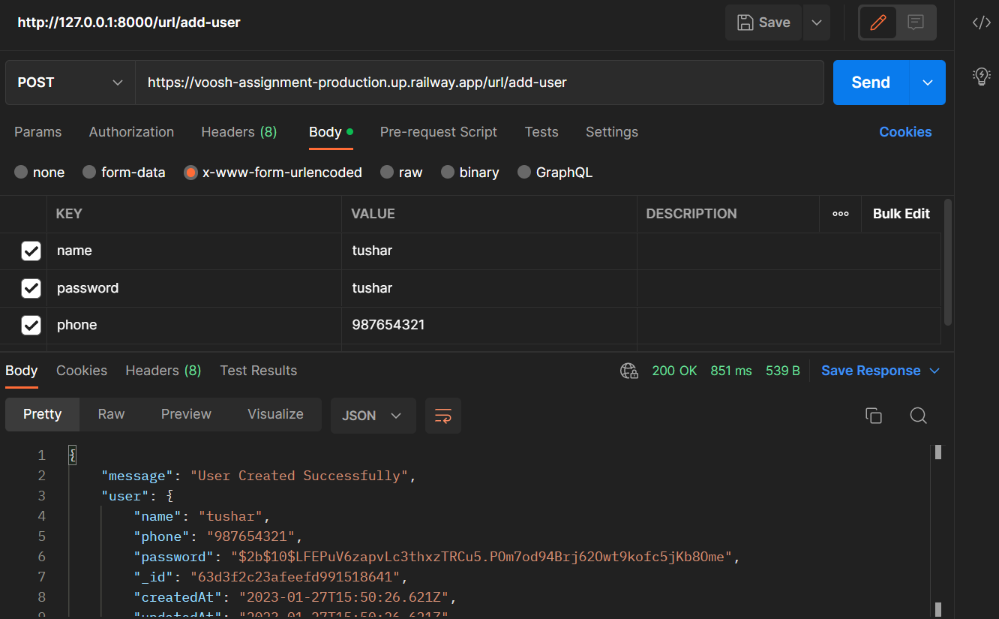
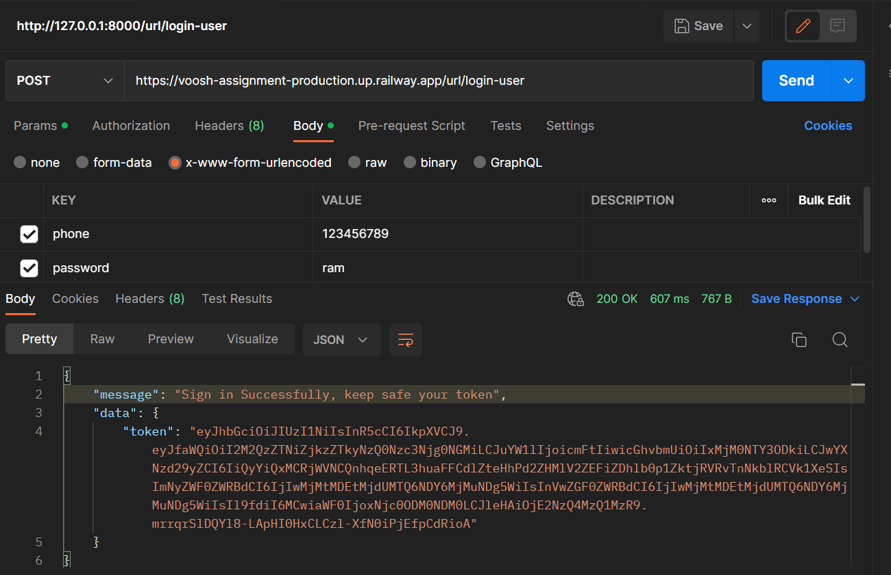
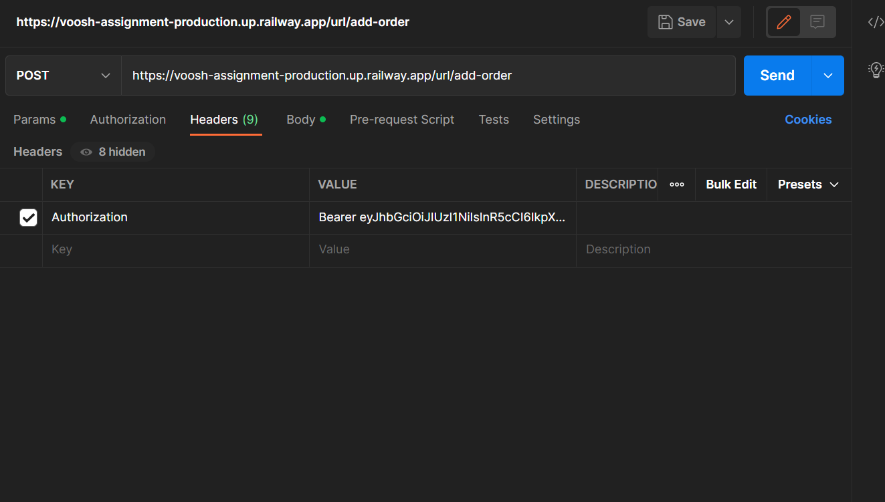
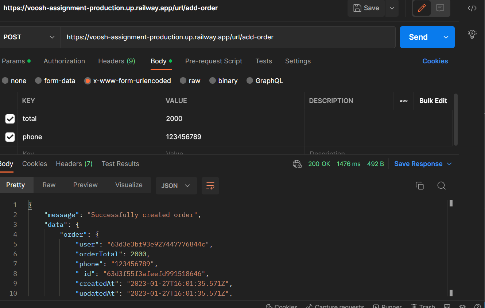
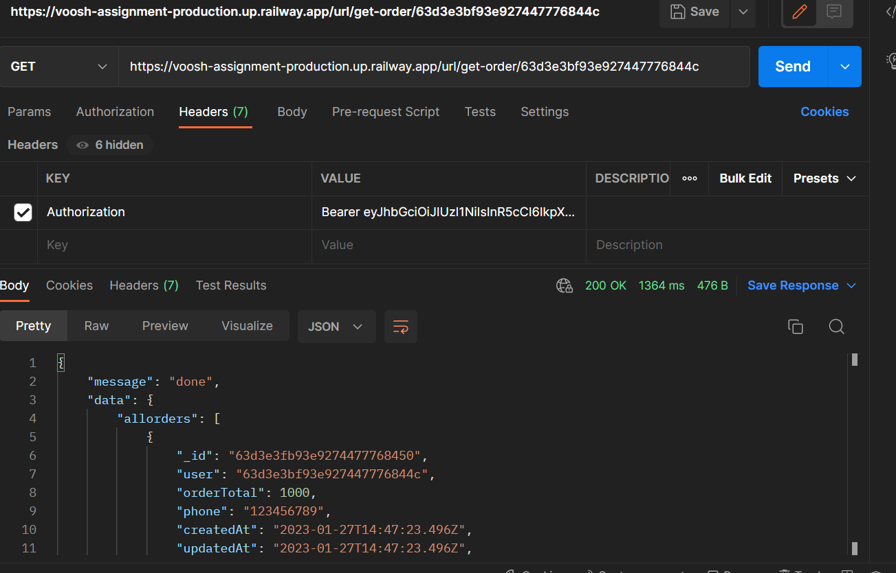

# voosh-assignment
We’re going to design an API 

##Functionality
1. User can sign up and sign in 
2. user can make order
3. user can get all orders 

##Tools 
1. Node Js  v-16.18.0
2. Express Js
3. Mongodb  v-5.0.13
4. Mongoose
5. passport JWT (for authentication purpose)
6. brypt for encrypt password

##Setup in Local System

1. clone the repo in your System.
2. go to folder you want open cmd/power shell/git-bash. 
3. then just run:- git clone https://github.com/tush8788/voosh-assignment.git
4. after download done 
5. open command prompt and Type 'npm install' for download all dependencies 
6. then just "npm start"/ if npm start is not work just run this command 'node index.js'
7. then go localhost:8000

## This Site is hosted on railway.app
1. Access link "https://voosh-assignment-production.up.railway.app/"

##Screen Short
1. create user

2. Login user

3. Set Token for Authorise request inside header of all requests

4. make a order

5. get all order of given user

